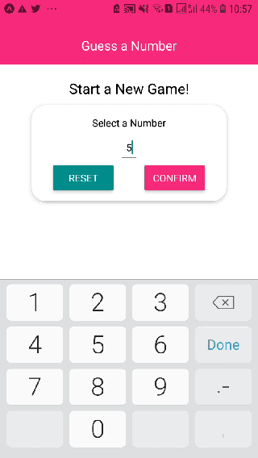

# Guess a number 

## Credit

The second app based on [React Native - Practical Guide 2020](https://www.udemy.com/course/react-native-the-practical-guide/) by [Academind by Maximilian Schwarzmüller](https://academind.com/)

## TODOs

- [ ] Figure how to store a template of React component for quick start in VSCode
- [ ] Different methods to export/import components - pros and cons
- [ ] Learn awesome shortcuts for VSCode, e.g. [concurrent multiline edit](https://stackoverflow.com/questions/30037808/multiline-editing-in-visual-studio-code)
- [ ] Memorize names of nice [react native colors](https://reactnative.dev/docs/colors)
- [ ] Explore [React Native Elements](https://github.com/react-native-training/react-native-elements) and [Native Base](https://github.com/GeekyAnts/NativeBase) for UI.
- [x] Screen record demo
- [ ] Learn react native navigation logic!

## Demo

